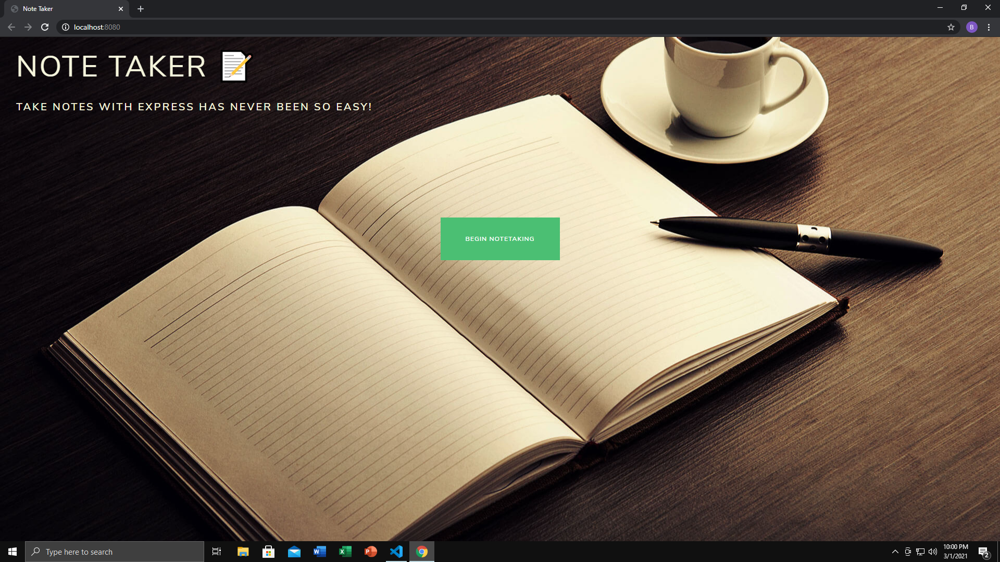
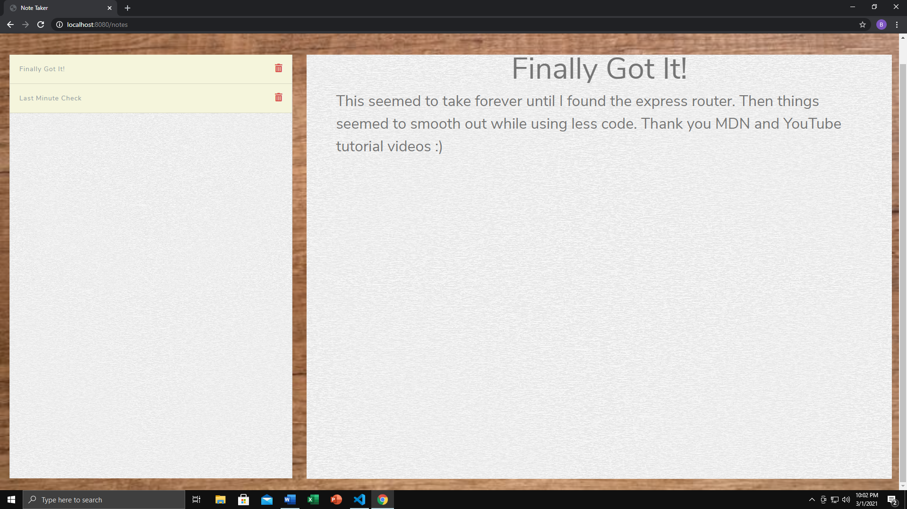
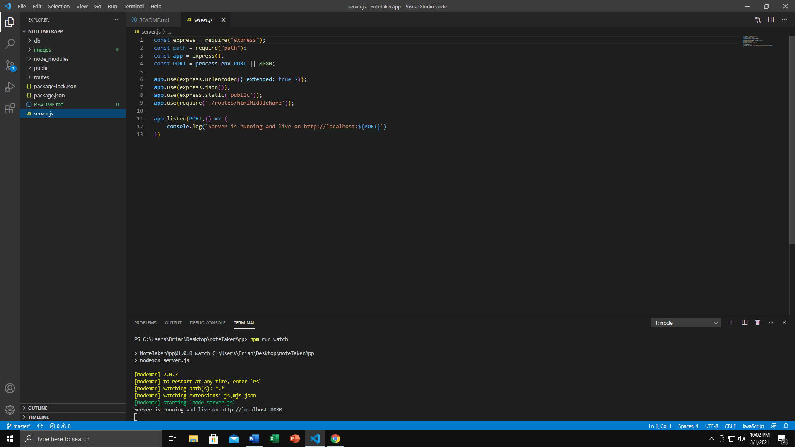
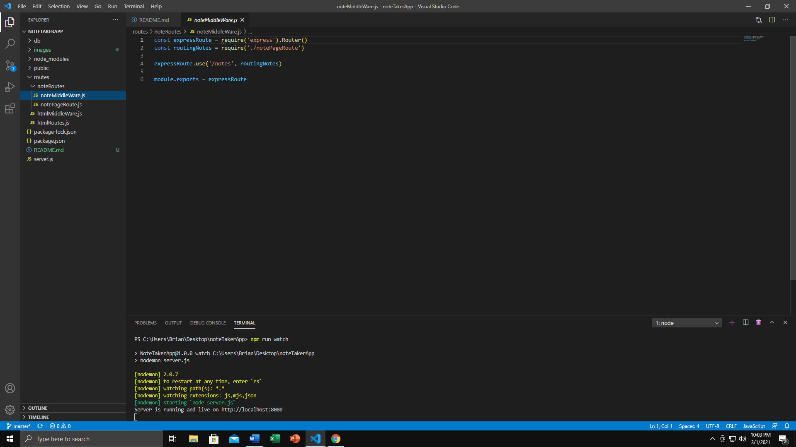
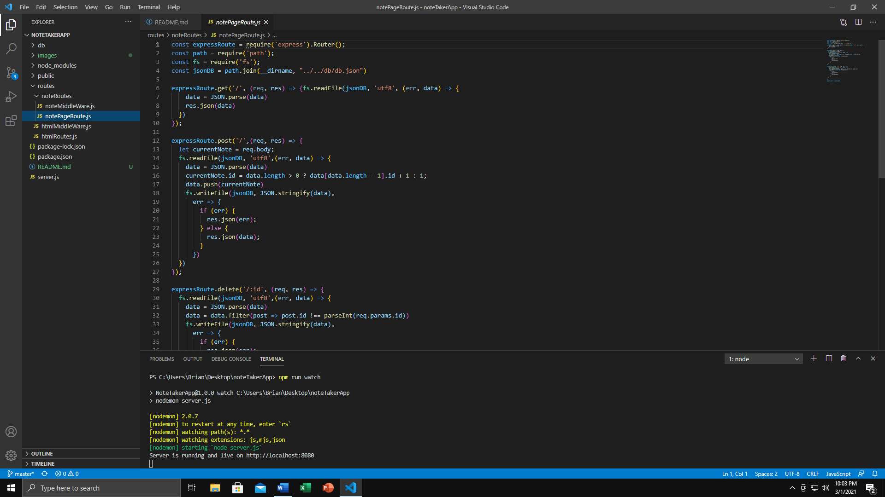
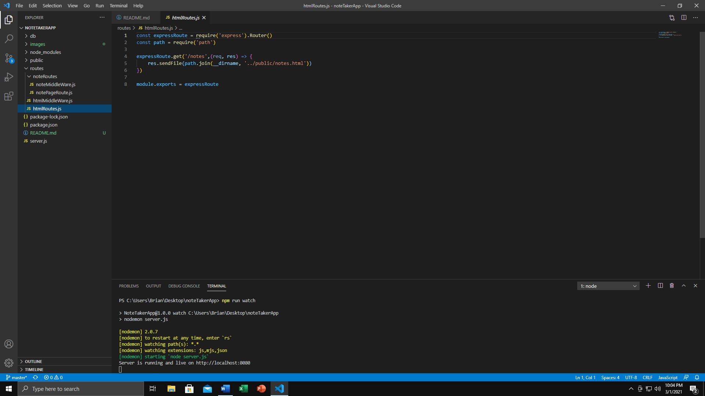

<head>
   <h1>Note Taker Application</h1>
</head>

<body>

   <h2>Purpose:</h2>

   
The purpose behind this activity was to take already existing code (legacy). Create a server and routing files for the frontend app that would allow the user to jot down random thought or notes for later. Have the ability to save notes that are created. While allowing the user to delete notes they may no longer need.

   <h2>Task List:<h2>

   <ol>
      <li>Deploy a functional and polished webpage.</li>
      <li>Provide the user with the ability to write notes when opening page.</li>
      <li>Allow the user to save their notes and be able to come back to them later.</li>
      <li>Give the user a way to delete notes that are no longer useful.</li>
   </ol>

   <h2>Website Deployment</h2>

   
 The current version of this portfolio can be found here. <a href="https://bhamm90.github.io/noteTakerApp/">(Note Taker Application)</a>

   <h2>Feedback</h2>

   
 Please get ahold of me with any suggestions for features/items you believe should be added. Also feel free to let me know of any issues you may come across while using the page. You can reach me on <a href="https://stackoverflow.com/users/14324130/bhamm90">Stack Overflow</a> with any comments and concerns. For any issues and fixes you can file an issue at the <a href="https://github.com/BHamm90/noteTakeApp/issues">Note Taker Application link </a> <-- so I can fix them as soon as possible. 

   <h3>Website Preview:</h3>

   
   
    

   <h3>Preview of the JavaScript</h3>

   

   
   
   
   
   
   
   

   <h4>Looking Forward: </h4>

   
 Looking forward I would like to continuing my learning on databases. May try to find a way to clean up some of the code or use an actual DB for storing notes. Would love to hear suggestions so I can continue building on this idea.
</body>

<Footer>

 © 2021 Trilogy Education Services, a 2U, Inc. brand. All Rights Reserved. 

</Footer>